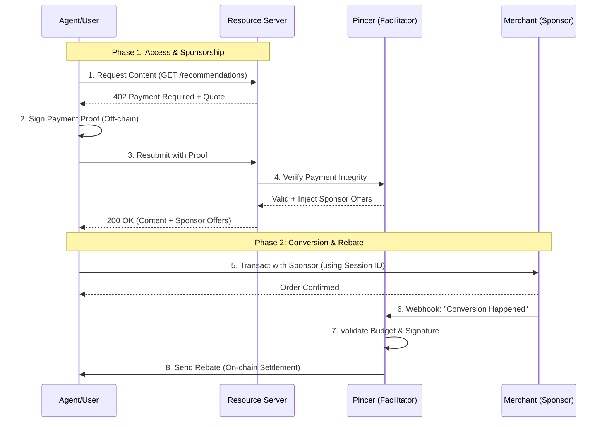

# Pincer x402 Reference Implementation

[](https://github.com/pincerclaw/pincer-x402-starter/actions/workflows/sdk-ci-cd.yml)
[](https://pypi.org/project/pincer-sdk/)
[](https://colosseum.com/agent-hackathon/projects/pincer-ad-protocol-for-ai-agents)

**The standard implementation for Pincer's x402-sponsored access protocol.**

This project demonstrates a complete, production-ready flow where content access acts as a lead generation mechanism for sponsors. Instead of users paying for content directly, sponsors subsidize the cost in exchange for high-intent leads, with settlement occurring on-chain.

**Resources:**

- [Product Demo](https://pincer-web.pages.dev/)
- [Pitch Deck](https://pincer-pitch.pages.dev)
- [Security Audit Report (Eric, Gemini AI)](audit_reports/pincer_audit_2026_02.md)

---

## 🚀 Quick Start

The fastest way to get the demo running.

### 1. Prerequisites

- **Python 3.10+**
- **[uv](https://github.com/astral-sh/uv)** (Fast Python package installer)
  ```bash
  curl -LsSf https://astral.sh/uv/install.sh | sh
  ```

### 2. Installation

```bash
# Clone the repository
git clone https://github.com/pincerclaw/pincer-x402-starter.git
cd pincer-x402-starter

# Run the setup script (installs dependencies, sets up virtualenv)
./scripts/setup_uv.sh
```

### 3. Configuration

Copy the example environment file and add your wallet keys:

```bash
cp .env.example .env
nano .env
```

> **Required:** Set `TREASURY_SVM_PRIVATE_KEY` (Solana) or `TREASURY_EVM_PRIVATE_KEY` (Base) to enable real on-chain settlement. If left blank, the system runs in **Simulation Mode**.

### 4. Run the Demo

For a full end-to-end flow, you need to run three separate services.

#### Option A: One-click local setup (Recommended for development)

We provide a helper script to start all services (Facilitator, Resource, Merchant) in separate processes:

```bash
uv run scripts/run_all.py
```

#### Option B: Manual independent startup

Start each service in a separate terminal window:

1. **Pincer Facilitator**: Core protocol engine.

   ```bash
   uv run python src/pincer/server.py
   ```

2. **Resource Server**: Paywalled content provider.

   ```bash
   uv run python src/resource/server.py
   ```

3. **Merchant Server**: Sponsor backend.
   ```bash
   uv run python src/merchant/server.py
   ```

**Terminal 2: Run the Demo Agent**
_Simulates a user requesting content from the Resource Server._

```bash
uv run python src/agent/demo.py
```

---

## 🔄 Architecture Flow

How the components interact to deliver sponsored free access.



---

## 🛠️ Components

### 1. Resource Server (`src/resource/`)

Represents a premium API or content platform.

- Protects endpoints using the **Pincer SDK Middleware**.
- Automatically delegates payment verification to Pincer.
- Injects active sponsor offers directly into the application context.

### 2. Pincer Service (`src/pincer/`)

The core infrastructure.

- **Facilitator**: Verifies x402 payment proofs.
- **Sponsorship Engine**: Matches users with active campaigns.
- **Settlement**: Listens for merchant webhooks and executes on-chain rebates (EVM/SVM).

### 3. Merchant Server (`src/merchant/`)

Represents a sponsor's backend.

- Receives traffic via tracking links.
- Reports conversions back to Pincer via signed webhooks.

### 4. Agent Client (`src/agent/`)

A reference implementation of a client utilizing the x402 protocol.

- Handles the 402 Challenge-Response flow automatically.
- Manages wallet keys and signing.

---

## 📚 API Reference

### Resource: Get Recommendations

`GET /recommendations`

- **Headers**: `X-Correlation-Id` (optional)
- **Response**:
  ```json
  {
    "restaurants": [...],
    "sponsors": [
      {
        "sponsor_id": "camp-123",
        "merchant_name": "Shake Shack",
        "offer_text": "Free Fries with Burger",
        "rebate_amount": 5.0,
        "rebate_asset": "USDC",
        "checkout_url": "http://.../checkout?session_id=..."
      }
    ]
  }
  ```

### Pincer: Merchant Webhook

`POST /webhooks/conversion`
For merchants to report successful conversions.

- **Headers**: `X-Webhook-Signature` (HMAC-SHA256)
- **Body**:
  ```json
  {
    "webhook_id": "wh-uuid",
    "session_id": "sess-uuid",
    "timestamp": "2024-01-01T12:00:00Z",
    "user_address": "0x...",
    "purchase_amount": 25.0,
    "purchase_asset": "USD",
    "merchant_id": "my-store"
  }
  ```

---

## ⚙️ Configuration

Key environment variables in `.env`:

| Variable                   | Description                                  |
| -------------------------- | -------------------------------------------- |
| `PINCER_URL`               | URL of the Pincer service (Required)         |
| `RESOURCE_URL`             | URL of the Resource server (Required)        |
| `MERCHANT_URL`             | URL of the Merchant server (Required)        |
| `TREASURY_EVM_PRIVATE_KEY` | Private key for sending EVM rebates (Base)   |
| `TREASURY_SVM_PRIVATE_KEY` | Private key for sending SVM rebates (Solana) |
| `WEBHOOK_SECRET`           | Shared secret for signing merchant webhooks  |

---

## 🧪 Testing

To verify the entire system from scratch:

```bash
# Run the end-to-end demo script
uv run python scripts/test_payment.py
```

_Note: Ensure all services are running before executing the test._

---

## 📂 Examples

Explore these standalone scripts to understand specific integrations:

- **[Buyer Flow](examples/x402_buyer_flow.py)**: `examples/x402_buyer_flow.py`
  - Demonstrates how a client handles the 402 Payment Required response, signs the payment (SVM/Solana), and accesses content.
  - Connects to the live demo by default.

- **[Resource Server](examples/x402_resource_integration.py)**: `examples/x402_resource_integration.py`
  - Shows how to build a FastAPI server protected by `PincerPaymentMiddleware`.

- **[Sponsor Reporting](examples/sponsor_integration.py)**: `examples/sponsor_integration.py`
  - A simple script to simulate a backend reporting a conversion to Pincer.
  - Usage: `uv run python examples/sponsor_integration.py [session_id]`
