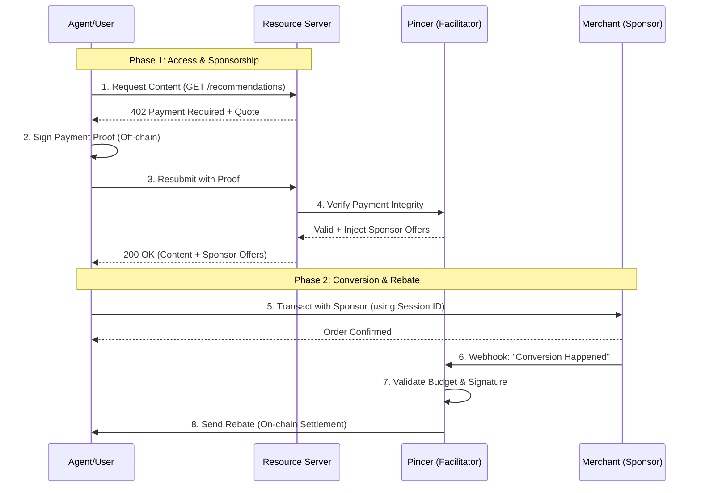

# Pincer x402 Reference Implementation

[](https://github.com/pincerclaw/pincer-x402-starter/actions/workflows/sdk-ci-cd.yml)
[](https://pypi.org/project/pincer-sdk/)
[](https://colosseum.com/agent-hackathon/projects/pincer-ad-protocol-for-ai-agents)
[](https://github.com/pincerclaw/pincer-x402-starter/tree/main/audit_reports)
[](https://x.com/pincerclaw)

**The standard implementation for Pincer's x402-sponsored access protocol.**

This project demonstrates a complete, production-ready flow where content access acts as a lead generation mechanism for sponsors. Instead of users paying for content directly, sponsors subsidize the cost in exchange for high-intent leads, with settlement occurring on-chain.

**Resources:**

| Resource                                                                                      | Description                                |
| :-------------------------------------------------------------------------------------------- | :----------------------------------------- |
| [🚀 Product Demo](https://pincer-web.pages.dev/)                                              | Experience the Pincer protocol in action.  |
| [📊 Pitch Deck](https://pincer-pitch.pages.dev)                                               | Overview of the vision and business model. |
| [📂 Audit Reports](https://github.com/pincerclaw/pincer-x402-starter/tree/main/audit_reports) | Comprehensive security evaluation.         |
| [📦 Pincer SDK](https://pypi.org/project/pincer-sdk/)                                         | Official Python SDK on PyPI.               |
| [📖 Human Docs](https://pincerclaw.github.io/pincer-x402-starter/)                            | Integration guide for developers.          |
| [🤖 Agent Skill](https://pincer.zeabur.app/skill.md)                                          | Protocol instructions for AI agents.       |
| [📡 API Reference](https://pincer.zeabur.app/docs)                                            | Technical API                              |

---

## 🚀 Quick Start

The fastest way to get the demo running.

### 1. Installation

```bash
# Clone the repository
git clone https://github.com/pincerclaw/pincer-x402-starter.git
cd pincer-x402-starter

# Run the setup script (installs uv, dependencies, sets up virtualenv)
make setup
```

### 3. Configuration

Copy the example environment file and add your wallet keys:

```bash
cp .env.example .env
nano .env
```

> **Required:** Set `TREASURY_SVM_PRIVATE_KEY` (Solana) or `TREASURY_EVM_PRIVATE_KEY` (Base) to enable real on-chain settlement. If left blank, the system runs in **Simulation Mode**.

### 3. Run the Demo

For a full end-to-end flow, you need to run three separate services (Facilitator, Resource Server, Merchant Server).

#### Step 1: Start the Ecosystem

The easiest way is to use our combined runner:

```bash
uv run scripts/run_all.py
```

#### Step 2: Run the Demo Agent

In a **new terminal window**, run the agent to simulate a user requesting content:

```bash
make demo
```

---

## 🔄 Architecture Flow

How the components interact to deliver sponsored free access.



---

## 🛠️ Components

### 1. Resource Server (`src/resource/`)

Represents a premium API or content platform.

- Protects endpoints using the **Pincer SDK Middleware**.
- Automatically delegates payment verification to Pincer.
- Injects active sponsor offers directly into the application context.

### 2. Pincer Service (`src/pincer/`)

The core infrastructure.

- **Facilitator**: Verifies x402 payment proofs.
- **Sponsorship Engine**: Matches users with active campaigns.
- **Settlement**: Listens for merchant webhooks and executes on-chain rebates (EVM/SVM).

### 3. Merchant Server (`src/merchant/`)

Represents a sponsor's backend.

- Receives traffic via tracking links.
- Reports conversions back to Pincer via signed webhooks.

### 4. Agent Client (`src/agent/`)

A reference implementation of a client utilizing the x402 protocol.

- Handles the 402 Challenge-Response flow automatically.
- Manages wallet keys and signing.

---

## 📚 API Reference

### Resource: Get Recommendations

`GET /recommendations`

- **Headers**: `X-Correlation-Id` (optional)
- **Response**:
  ```json
  {
    "restaurants": [...],
    "sponsors": [
      {
        "sponsor_id": "camp-123",
        "merchant_name": "Shake Shack",
        "offer_text": "Free Fries with Burger",
        "rebate_amount": 5.0,
        "rebate_asset": "USDC",
        "checkout_url": "http://.../checkout?session_id=..."
      }
    ]
  }
  ```

### Pincer: Merchant Webhook

`POST /webhooks/conversion`
For merchants to report successful conversions.

- **Headers**: `X-Webhook-Signature` (HMAC-SHA256)
- **Body**:
  ```json
  {
    "webhook_id": "wh-uuid",
    "session_id": "sess-uuid",
    "timestamp": "2024-01-01T12:00:00Z",
    "user_address": "0x...",
    "purchase_amount": 25.0,
    "purchase_asset": "USD",
    "merchant_id": "my-store"
  }
  ```

---

## ⚙️ Configuration

Key environment variables in `.env`:

| Variable                   | Description                                  |
| -------------------------- | -------------------------------------------- |
| `PINCER_URL`               | URL of the Pincer service (Required)         |
| `RESOURCE_URL`             | URL of the Resource server (Required)        |
| `MERCHANT_URL`             | URL of the Merchant server (Required)        |
| `TREASURY_EVM_PRIVATE_KEY` | Private key for sending EVM rebates (Base)   |
| `TREASURY_SVM_PRIVATE_KEY` | Private key for sending SVM rebates (Solana) |
| `WEBHOOK_SECRET`           | Shared secret for signing merchant webhooks  |

---

---

## 🧪 Verification

To verify that the entire system is properly configured and connected:

```bash
# Run the connectivity test script
uv run python scripts/test_payment.py
```

This script checks:

- Environment variable configuration
- Wallet address validity
- Basic connectivity to the Resource Server

---

## 🛠️ Troubleshooting

### Missing Private Keys

If you see errors related to `TREASURY_SVM_PRIVATE_KEY`, ensure you have generated a Solana wallet or set the keys in `.env`. By default, the system runs in **Simulation Mode** if keys are missing, but on-chain settlement requires them.

### SOL Faucet

If you are running on Solana Devnet, you'll need test SOL for transactions. Use the [Solana Faucet](https://faucet.solana.com/).

### Port Conflicts

The demo uses ports `4021`, `4022`, and `4023`. Ensure these ports are available on your machine.

## 📂 Examples

Explore these standalone scripts to understand specific integrations:

- **[Buyer Flow](examples/x402_buyer_flow.py)**: `examples/x402_buyer_flow.py`
  - Demonstrates how a client handles the 402 Payment Required response, signs the payment (SVM/Solana), and accesses content.
  - Connects to the live demo by default.

- **[Resource Server](examples/x402_resource_integration.py)**: `examples/x402_resource_integration.py`
  - Shows how to build a FastAPI server protected by `PincerPaymentMiddleware`.

- **[Sponsor Reporting](examples/sponsor_integration.py)**: `examples/sponsor_integration.py`
  - A simple script to simulate a backend reporting a conversion to Pincer.
  - Usage: `uv run python examples/sponsor_integration.py [session_id]`
