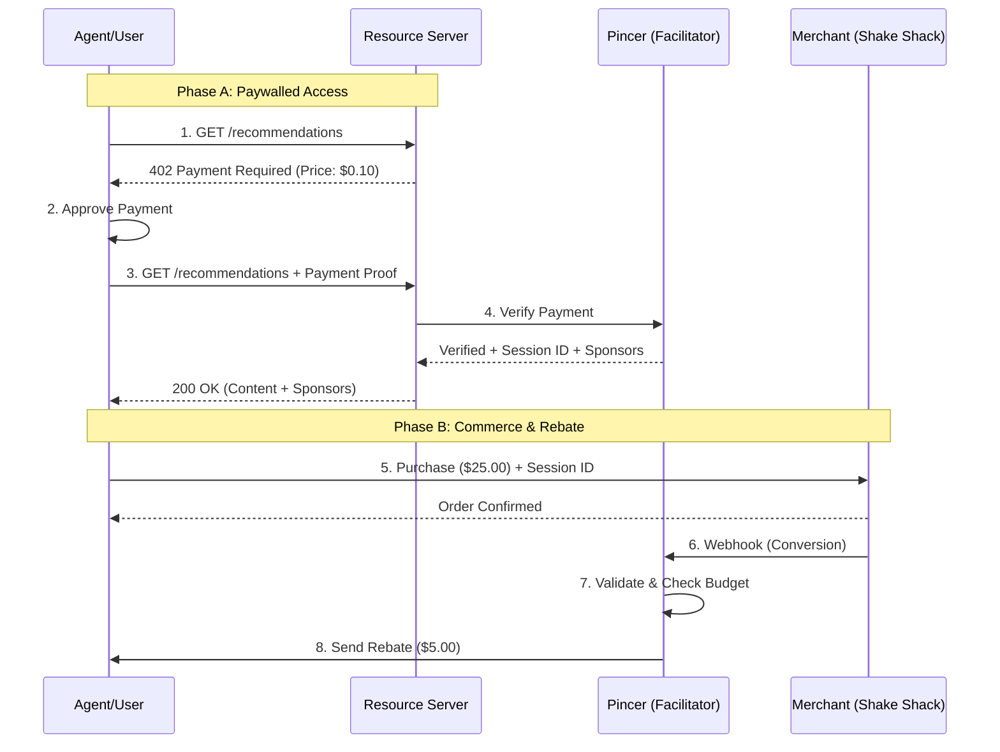

# Pincer x402 Reference Implementation

A production-quality reference implementation of Pincer's x402-sponsored access flow, demonstrating post-pay settlement for paywalled content.

## Overview

This project implements a complete x402 payment flow with Pincer acting as the facilitator.

1. **Paywalled Resource**: User accesses content protected by x402 (formerly TopEats).
2. **Pincer Facilitator**: Handles payment verification and settlement.
3. **Sponsorship Model**: Demonstrates how sponsors can subsidize content access via rebates.

## Architecture

The system consists of 4 main components interacting to provide a seamless paid content experience with sponsored rebates.



## Detailed Components

### 1. Resource Server (`src/resource/`)

_Previously "TopEats"_

- A generic wrapper for any paywalled content.
- Protects endpoints using `x402-server` middleware.
- Returns `402 Payment Required` with pricing details.
- Validates payment proofs via Pincer Facilitator.

### 2. Pincer (`src/pincer/`)

- **Facilitator**: Verifies x402 payments (`verification.py`).
- **Settlement**: Manages rebates and payouts (`payout.py`).
- **Webhooks**: Handles conversion events from merchants (`webhooks.py`).

### 3. Merchant (`src/merchant/`)

- A demo merchant server (e.g., Shake Shack).
- Accepts orders with a `session_id`.
- Sends signed webhooks to Pincer to trigger rebates.

## API Reference

### Resource Server (Port 4021)

#### `GET /recommendations`

Returns paywalled content.

**Response (402 Payment Required):**

```http
HTTP/1.1 402 Payment Required
WWW-Authenticate: x402 scheme="exact", pay_to="...", price="0.1"
```

**Response (200 OK):**

```json
{
  "restaurants": [...],
  "session_id": "sess-...",
  "sponsors": [
    {
      "sponsor_id": "shake-shack-promo",
      "offer_text": "Get $5.00 cashback...",
      "rebate_amount": "$5.00"
    }
  ]
}
```

### Pincer (Port 4022)

#### `POST /verify`

Verifies an x402 payment proof. Used by Resource Server.

**Request:**

```json
{
  "payment_proof": "base64_encoded_proof",
  "resource_id": "..."
}
```

#### `GET /settle/{session_id}`

Check settlement status for a session.

#### `POST /webhooks/conversion`

Endpoint for merchants to report conversions.

**Request:**

```json
{
  "webhook_id": "wh-...",
  "session_id": "sess-...",
  "amount_usd": 25.0
}
```

## Getting Started

### Prerequisites

- Python 3.10+
- `uv` (recommended) or `pip`

### Setup

1. **Clone & Install**

   ```bash
   git clone <repo>
   cd pincer-x402-starter
   ./scripts/setup_uv.sh
   # Follow the interactive setup
   ```

2. **Configuration**
   Edit `.env` with your wallet keys (Solana or EVM).

   ```bash
   cp .env.example .env
   ```

3. **Run Demo**
   Open 4 terminal windows and run:

   ```bash
   # T1: Resource Server
   uv run python src/resource/server.py

   # T2: Pincer Service
   uv run python src/pincer/server.py

   # T3: Merchant Demo
   uv run python src/merchant/server.py

   # T4: Agent Client
   uv run python src/agent/demo.py
   ```

   _Or use the launcher script:_

   ```bash
   ./scripts/start_service.sh
   ```

## Integration Guide

### For Content Providers

To protect your API with Pincer x402:

1. Wrap your API with `x402-server`.
2. Configure the Pincer Facilitator URL.
3. Accept the `session_id` returned after verification to track user sessions.

### For Merchants

To offer rebates:

1. Capture the `session_id` passed by the user during checkout.
2. Send a signed webhook to Pincer's `/webhooks/conversion` endpoint.
3. Pincer handles the payout to the user.

## Project Structure

```
src/
├── resource/    # Paywalled Content Server
├── pincer/      # Facilitator & Settlement Logic
├── merchant/    # Demo Merchant Server
├── agent/       # Demo Client
└── config.py    # Shared Configuration
```
