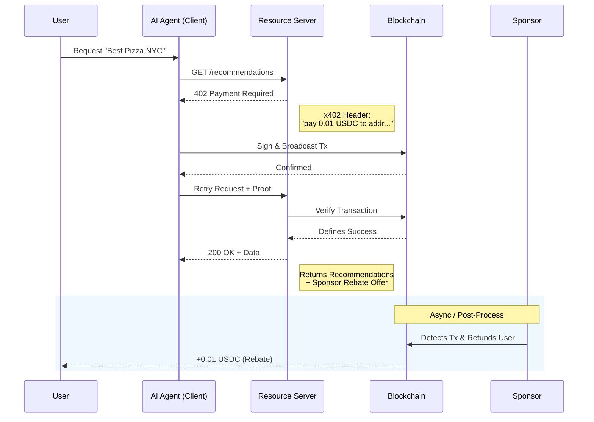

# Architecture

Pincer enables a seamless value exchange between AI agents and service providers.

## Protocol Flow

The core interaction follows the **Request-Pay-Verify-Rebate** cycle.

## Key Components

### 1. Resource Server (`x402-server`)

The gatekeeper. It intercepts requests, checks for valid payment headers, and issues 402 challenges if payment is missing. In Pincer, this is wrapped by `PincerResourceServer` for simpler integration.

### 2. Facilitator (Verified by Pincer)

An on-chain or off-chain entity that verifies the payment occurred. Pincer acts as a facilitator, indexing blockchain events to confirm transactions instantly.

### 3. Sponsors

Third-party entities (like Restaurants, Brands) that configure "Campaigns". If a user's request matches a campaign criteria (e.g., "User paid for Pizza search"), the sponsor triggers a rebate transaction to the user's wallet.
